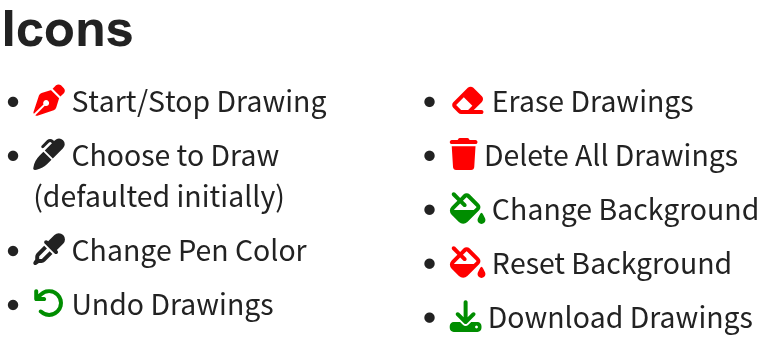

# Qdraw Extension For Quarto

Allows drawing and erasing in a revealjs presentation rendered via quarto.

## Demo

[Get a demo here](https://www.thinkermahmud.com/qdraw) and its source code [here](https://github.com/mahmudstat/qdraw/blob/main/example.qmd)

This tool is practically used in my statistics and probability lecture slides on Stat Mania. [See them in action](https://docs.statmania.info/lectures.html)

## Installing

```bash
quarto add mahmudstat/qdraw
```

This will install the extension under the `_extensions` subdirectory.
If you're using version control, you will want to check in this directory.

## Using

- Add your contents to `qmd` file and render.
- Click on the draw icon <i class="fas fa-pen-nib"></i> to activate the drawing tools. Click the icon again to hide the tools.
- Use the self-explanatory tools as per your requirements.
- Read more here about [using the icons](https://www.thinkermahmud.com/qdraw/index.html#/icons)


